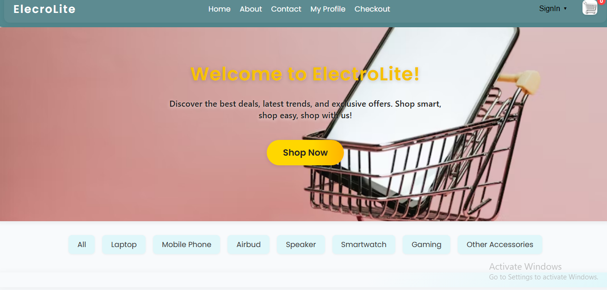
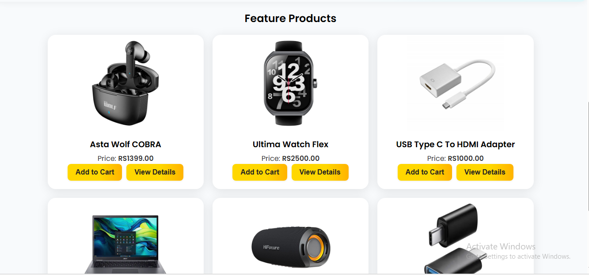
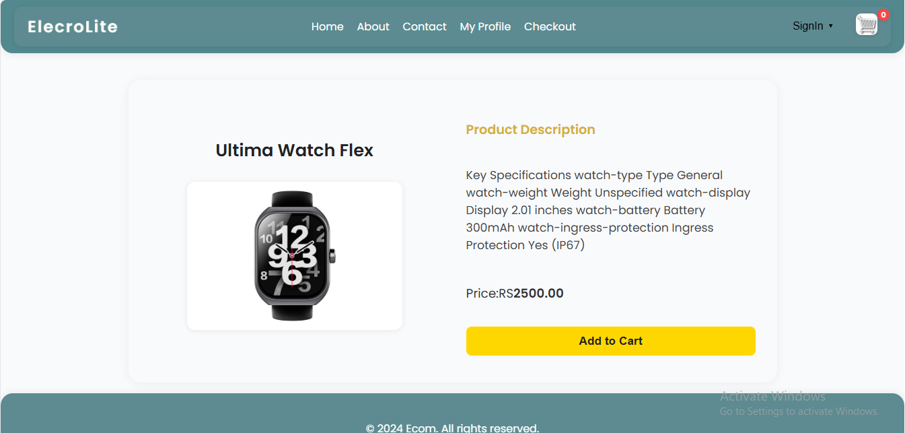
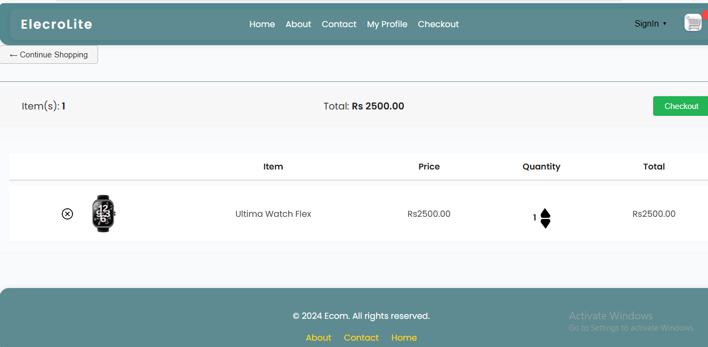
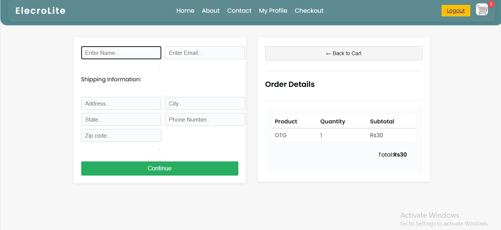
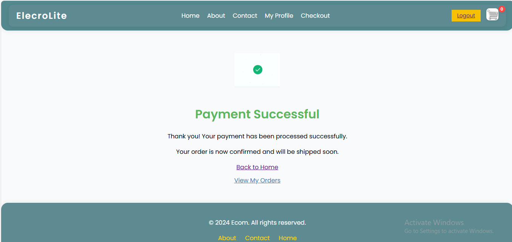
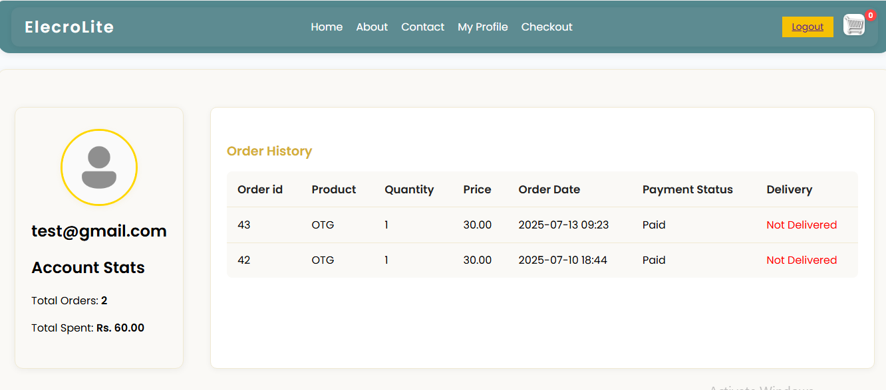

# ⚡ Electrolite – E-Commerce Website for Electronics

A full-stack e-commerce platform built using **Django**, **HTML/CSS**, **JavaScript**, and **AJAX**, featuring dynamic product listings, cart management, user authentication, and secure **eSewa payment integration**.

---

## 🌟 Features

### 🛒 Customer Features
- **User Authentication**: Login, register, and session-based auth
- **Product Browsing**: Category-wise product filtering
- **Product Details**: View detailed product descriptions with images
- **Shopping Cart**: Add/remove items with quantity handling
- **Checkout System**: Secure address form and order summary
- **Order History**: Profile section with past orders
- **eSewa Payment**: Online payment via eSewa gateway

### 🛠️ Admin Features
- **Product Management**: Add, update, and delete products using Django Admin
- **Order Monitoring**: View orders placed by customers and track delivery status
- **User Management**: Manage registered users and their activities
- **Shipping Tracking**: Monitor shipping address information for each order
- **Django Admin Panel**: Fully configured and secured with superuser access

---

## 🛠️ Tech Stack

| Layer       | Technology                            |
|-------------|----------------------------------------|
| Frontend    | HTML, CSS, JavaScript, AJAX            |
| Backend     | Django (Python)                        |
| Database    | MySQL (via XAMPP)                      |
| Payment     | eSewa with HMAC-SHA256 signature       |
| Other Tools | XAMPP, Django Auth |

---

## 🔐 Payment Integration – eSewa

- Integrated **eSewa UAT environment** for testing.
- Uses **HMAC-SHA256** for secure payment signature verification.
- Order marked as "Paid" only after successful verification.

🧪 Test Merchant: `EPAYTEST`  
🔗 [eSewa Developer Portal](https://developer.esewa.com.np/)

---

## 📁 Project Structure
Ecommerce_website/
│
├── README.md
├── requirement.txt
├── manage.py
├── ecommerce_db.sql
│
├── ecommerce_website/           # Django project config
│   ├── __init__.py
│   ├── asgi.py
│   ├── settings.py
│   ├── urls.py
│   ├── wsgi.py
│   └── __pycache__/
│
├── ecommerce_app/               # Main e-commerce app
│   ├── __init__.py
│   ├── admin.py
│   ├── apps.py
│   ├── middleware.py
│   ├── migrations/
│   ├── models.py
│   ├── tests.py
│   ├── urls.py
│   ├── views.py
│   └── __pycache__/
│
├── user_auth/                   # User authentication app
│   ├── __init__.py
│   ├── admin.py
│   ├── apps.py
│   ├── migrations/
│   ├── models.py
│   ├── tests.py
│   ├── urls.py
│   ├── views.py
│   └── __pycache__/
│
├── templates/                   # HTML templates
├── static/                      # Static files (CSS, JS, images)
├── media/                       # Uploaded media files


---

## 🚀 Getting Started

### ✅ Prerequisites
- Python 3.x
- XAMPP (for MySQL, if you use MySQL; otherwise, SQLite is default in Django)
- pip (Python package manager)
- Virtualenv (optional but recommended)

### 🛠️ Setup Instructions

```bash
# Clone the repo
git clone https://github.com/KailashThapa-dev/Ecommerce_website.git
cd Ecommerce_website

# (Optional) Create and activate a virtual environment
python -m venv venv
# On Windows:
venv\Scripts\activate
# On macOS/Linux:
source venv/bin/activate

# Install dependencies
pip install -r requirement.txt

# Run database migrations
python manage.py makemigrations
python manage.py migrate

# (Optional) Create a superuser for admin access
python manage.py createsuperuser

# Start development server
python manage.py runserver
```
---

## 🧪 Testing the Project

Once your server is running:

- Visit [http://127.0.0.1:8000](http://127.0.0.1:8000) to browse the shop
- Visit [http://127.0.0.1:8000/admin](http://127.0.0.1:8000/admin) to access the Django Admin
- Add products via Admin Panel or directly via database
- Test placing orders through:
  - Add to Cart (via JS + localStorage)
  - Checkout page
  - eSewa payment integration (redirect to sandbox)
- Profile dashboard will show order history after successful payment

---

## 💳 eSewa Payment Flow

1. User adds products to cart
2. Proceeds to **Checkout**, fills in shipping information
3. Clicks “Pay with eSewa”
4. Redirects to **eSewa Sandbox**
5. On successful payment, redirected to `/esewa_verify/`
6. Order gets stored in DB and marked as `Paid`
7. Session is cleared, and success page is shown

> ✅ Use eSewa's test credentials for local testing (`EPAYTEST` and provided secret key)

---
## 🖼️ Screenshots

### 🏠 Home Page



### 📄 Product Details


### 🛒 Cart


### 🧾 Checkout


### 💳 Payment via eSewa


### 👤 User Profile



---

## 🔒 Security Features

- Passwords hashed using Django’s auth system
- CSRF protection for all forms
- Login required decorators for protected views
- Secure transaction signature (HMAC-SHA256)

---

## 📂 Database Backup

If you want to load the provided SQL dump:

1. Open XAMPP > Start MySQL
2. Go to [phpMyAdmin](http://localhost/phpmyadmin/)
3. Create a DB: `ecommerce_db`
4. Click **Import** and upload `ecommerce_db.sql`

---

## 🤝 Credits

- [Django](https://www.djangoproject.com/)
- [eSewa Developer Portal](https://developer.esewa.com.np/)
- Django Documentation
- Stack Overflow (🧠😄)

---

## 📄 License

This project is licensed under the **MIT License** – you are free to use, modify, and distribute this project with attribution.

---

## 👨‍💻 Author

**Kailash Thapa**  
Full-Stack Developer – Nepal 🇳🇵  
📧 Email: kailassthapa73@gmail.com  
🔗 GitHub: [KailashThapa-dev](https://github.com/KailashThapa-dev)

---


